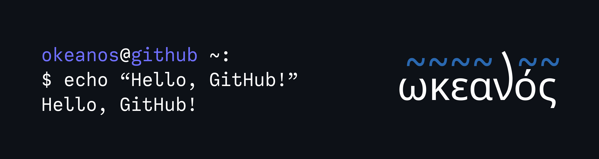

# Ωκεανός (Okeanos) : Shell done wrong.


Okeanos is a shell project for fun, not aimed to replace your current shell.
It uses termion for Raw terminal which lets it get user input without needing the user to press Enter.

<p align="center"></p>

## Prerequisites

If you are running a Windows NT system, please use WSL (Windows Subsystem for Linux), **Okeanos does not support Windows**, support for it is unlikely to happen.<br>
However, if you are using MacOS or (any) Linux (distro), you can continue the installation process.

- Rust programming language
- `git` or `gh` ([Github CLI](https://cli.github.com/))

## Installation (unstable)

Currently, there are no stable releases of Okeanos, cloning the repository directly will give you the in-development or unstable version.

1. Clone the repository via any option in the "**<> Code**" tab, which can be found on the top of the GitHub repository's page.
2. Run the following command in the `Okeanos/` directory
```
cargo build
```
3. Okeanos would be compiled as an executable inside the `target/` directory

## Contributing

You can help the project by contributing to it via forking it and creating a pull request. Instructions on how to fork it can be found [here](https://docs.github.com/en/get-started/quickstart/contributing-to-projects).

## GitHub pages

GitHub pages for Okeanos will depend on whether if I want to take it to the next steps.

## License

Repository licensed under the [MIT](LICENSE) license.